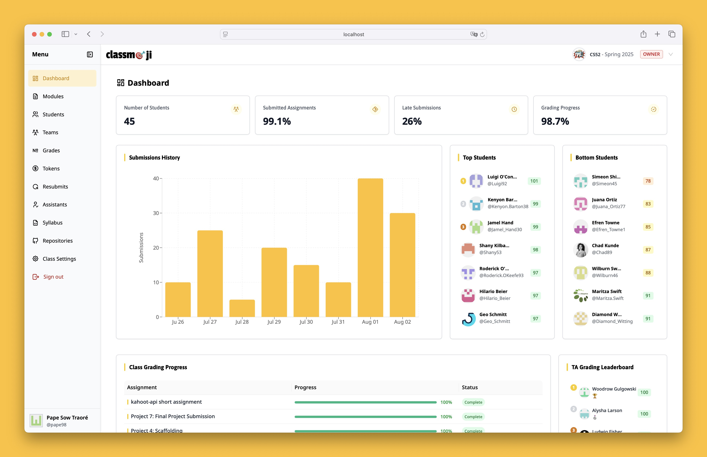

<h1>From 🤷 to 🎯 all in one platform.</h1>

A modern teaching platform that transforms how educators manage coding assignments. Built as a GitHub-native alternative to traditional classroom tools, it combines the power of version control with intuitive, emoji-based grading and flexible deadline management.

[Website](https://classmoji.io) | [Documentation](https://docs.classmoji.io) | [Discord](https://discord.gg/Bxvkh3SHeF) | [Discussions](https://github.com/classmoji/classmoji/discussions)

## ✨ What Makes Classmoji Special

**🎨 Emoji-Powered Grading**  
Replace intimidating numbers with expressive emojis. Each emoji maps to scores, token rewards, and feedback descriptions—making grades more human and less stressful.

**🪙 Token-Based Flexibility**  
Give students agency over their deadlines. They can spend tokens to submit late work without penalty, eliminating the need for constant extension requests.

**🤖 Seamless GitHub Integration**

- Auto-creates repositories for every student or team
- Uses GitHub Issues as assignments
- Maintains real-world development workflows

**👥 Built for Scale**  
From small seminars to large lectures, Classmoji handles TA assignment, grading distribution, and progress tracking automatically.

## 🚀 How It Works

### 👩‍🏫 For Instructors

1. **Set up your GitHub Organization** and connect it to Classmoji
2. **Create modules** (projects) with template repositories
3. **Add assignments** as GitHub Issues with customizable deadlines and token costs
4. **Publish modules** to auto-generate student/team repositories
5. **Grade with emojis** and let TAs help with the workload

### 🧑‍🎓 For Students

1. **Sign in with GitHub** and confirm your identity
2. **Join your class** and accept the GitHub organization invite
3. **Work on assignments** in your private repositories
4. **Submit by closing issues** when your work is complete
5. **Use tokens wisely** for deadline extensions and resubmissions

### 🤝 For Teaching Assistants

1. **Get assigned to students** or modules automatically
2. **Access grading dashboards** with submission status and links
3. **Provide emoji feedback** quickly and consistently
4. **Track progress** across your assigned responsibilities

## 🎯 Perfect For

- **Programming Courses**: Individual coding assignments with clear feedback
- **Team Projects**: Capstone work with shared repositories and fair grading
- **Large Classes**: Scalable grading with TA coordination
- **Flexible Learning**: Token systems that support student agency

## 🌟 Key Features

### 📚 Course Management

- Auto-generated student/team repositories from templates
- GitHub Issues as assignment delivery mechanism
- Flexible module and assignment organization
- Built-in deadlines and release scheduling

### 🎨 Smart Grading

- Customizable emoji-to-score mapping
- Token rewards for exceptional work
- Resubmission support with instructor approval

### ⏰ Deadline Flexibility

- Token-based late submission system
- No more manual extension approvals
- Transparent cost system (e.g., 5 tokens = 1 hour extension)
- Manual token management for special cases

### 👨‍🏫 Teaching Support

- TA assignment and distribution
- Role-based dashrooms and permissions
- Progress tracking and analytics
- Grade export and reporting

### 🔒 Security & Privacy

- FERPA-compliant data handling
- End-to-end encryption
- Private network isolation
- Limited data collection focused on educational needs

## 🤝 Contributing

We welcome contributions! Please see our [Contributing Guide](CONTRIBUTING.md) for details.

- 🐛 [Report bugs](https://github.com/classmoji/classmoji/issues/new?template=bug_report.md)
- 💡 [Request features](https://github.com/classmoji/classmoji/issues/new?template=feature_request.md)
- 💬 [Join discussions](https://github.com/classmoji/classmoji/discussions)
- 🗨️ [Chat with us on Discord](https://discord.gg/classmoji)

## 🎓 Educational Philosophy

Classmoji believes in:

- **Feedback over punishment** - Emojis create conversation, not judgment
- **Agency over rigidity** - Tokens let students manage their own time
- **Real tools over toys** - GitHub skills transfer to professional development
- **Scale with humanity** - Automation handles logistics, humans handle learning

## 🙏 Acknowledgments

Special thanks to all our contributors and the educational community for their feedback and support.

---

_Making coding education more human, one emoji at a time._ 😊

**[⭐ Star us on GitHub](https://github.com/classmoji/classmoji) if you find Classmoji useful!**
