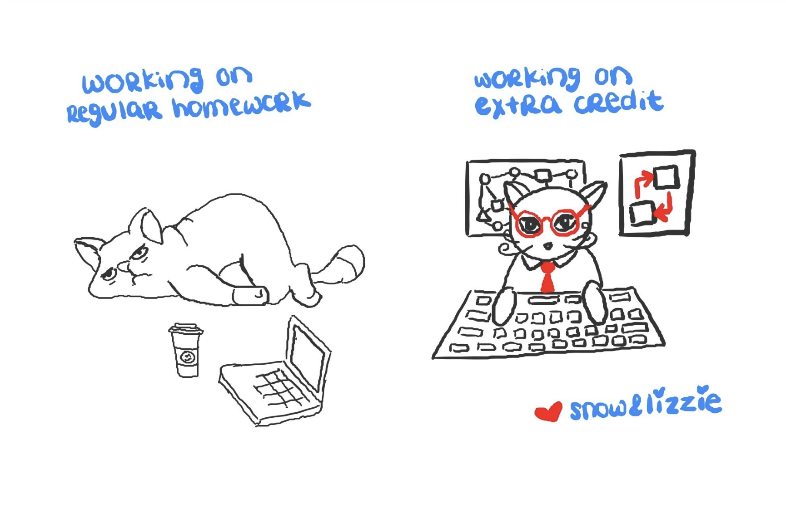
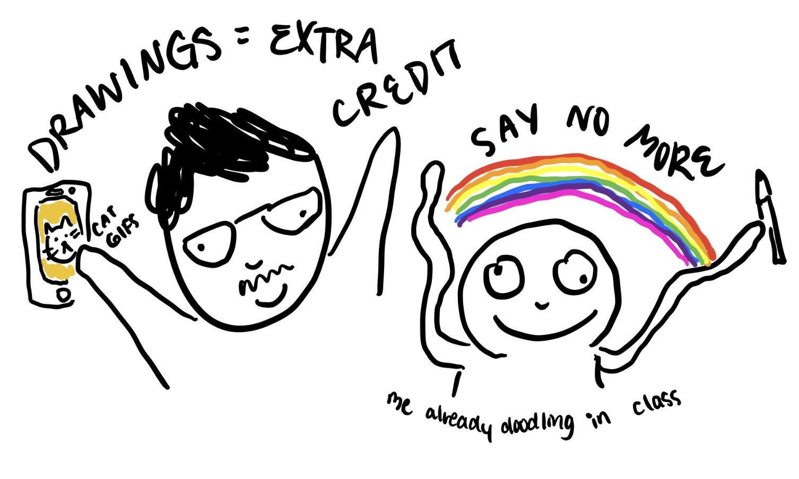

# Some of the Pedagogy Behind Classmoji 🎓✨

So, full transparency, we've been working on [Classmoji](https://classmoji.io) for years, and we're just now ready to share it. Classmoji is the product of years of teaching experimentation in my classes [CS52](https://cs52.me) and [CS98](https://cs98.me) at [Dartmouth College's Computer Science Department](https://web.cs.dartmouth.edu) and the [DALI Lab](https://dali.dartmouth.edu); years of being an opinionated self-motivated home-schooled student myself; and years of talking to students about how to make their learning journey more effective. 

My teaching philosophy is rooted in these truths‼️:

* **Learning is a naturally joyful human activity**
* **Learning is driven by curiosity and exploration**
* **Learning is fulfilled by creation aka goal driven problem-solving**

Classmoji isn't just about streamlining repository management, assignment creation, permissions, TA load-balancing, grading collation, etc, although it does all of those things. Classmoji is about **reimagining how we teach, assess, and support learning—especially in technical/coding and project focused courses.**  

🤯 Insert rant:  *And we desperately need some reimagining. So called "higher-ed" pedagogy hasn't evolved much since the Ford Model T.  We sit groups of chronologically aligned people down in big brick buildings, talk at them, assign expensive textbooks, give them a letter or number to indicate their performance, and hope that they have enough attention span to absorb something.  I am, of course, exaggerating, there are innovations such as making students watch videos, use online forums, and discuss the weather together in breakout-groups. Teaching is hard!*

Back to Classmoji. The goal is to better support project-based courses, especially in the AI age. Let's run through some of the features:

- GitHub-native to support code and technical assignments
- Feedback focused grading system
- Gamified late policy
- Iterative resubmissions encouraged to promote mastery
- TA assignment and load balancing
- Team project support end-to-end
- Individual team project contribution accounting
- AI driven "oral" assessments (coming soon)

Today, we'll focus on 🐘 grades.

---

## Why Grades Don’t Work the Way We Think

There is an unspoken assumption that giving conventional grades will accomplish three things:

1. Motivate students  
2. Provide feedback  
3. Signal skill level to others (e.g., employers)  

But the evidence says they’re surprisingly bad at all three. 

1) **Grades (aka a stick) are poor motivation.** Some more effective techniques would be: make assignments more interesting, but damn that is hard; peer accountability through showing student work to their peers or peer reviews, surprisingly effective, at the end of the day we are social animals and care what our friends think; various reward systems such as praise -- research says that praise is more effective than money (and I'm assuming more effective than a grade).   

2) **Grades are lazy feedback.**  Does getting a B+ or a 93 really help a student understand what they need to do to learn?  Nope, constructive, actionable narrative feedback is much better. In the software industry, specific pull request reviews are how we grow and learn, can we do that in class?

3) Where do we start... **Nobody gives a f\*\*\* what grade you got.** A person's story is more important than their certification. The whole academic premise that grades correspond to some sort of valuation of excellence is broken. I've had 4.0 students who knew how to choose classes and play to the rubric to get straight As, and I've had students who struggled and cried through every CS class but persevered.  Who do you think I respect more? Who do you think was more able to face hardships and innovate and lead?

Traditional grades are inconsistent, bias-prone, and often fail to motivate learning or provide meaningful feedback ([Schinske & Tanner, 2014](https://doi.org/10.1187/cbe.cbe-14-03-0054)). Grades tend to reward rule-following over curiosity, and they often communicate little about how a student can improve.

---

## Lessons from Going Pass/Fail

During the pandemic, we had one term that was pass/fail. I was terrified; students wouldn't push themselves, and they wouldn't do the final project if they were already passing. To my surprise, the class did better than usual.

This matches recent research showing that removing traditional grades can **increase motivation** and **reduce rote learning** without lowering achievement ([Kjærgaard et al., 2024](https://doi.org/10.1080/03075079.2023.2233007)). Freed from point-chasing, students focused more on learning itself. High performers pushed further, while struggling students re-engaged without fear of “digging a hole” in their GPA.

It was an excellent experiment and changed how I taught. Yes, there were probably some confounding factors, people were at home, classes were something to focus on, and this class had group-projects so it also provided social connection.  

---

## Emoji?!?! 🎉

I have since been grading with a new system:

- **🔥/🚀** – Above and beyond: extra credit, mastery, standout creativity  
- **👍** – Satisfactory work meeting basic expectations  
- **👀** – Not yet satisfactory 
- **👎/😭** – Yikes!

An average of 👍 translates to roughly an A-.  A totally fine grade, but not mastery. To reach the top, students have to innovate and earn some 🔥.

Turns out for graders and for students, an emoji removes all the associations that come with a number or a letter.  A student can intuitively know that yeah, a 👍 is fair for what they did. They don't argue that you deducted 2 points for some seemingly arbitrary mistake. The intuitive visual aspect here is important. For graders similarly, they no longer get stuck penalizing and deducting points. Nobody enjoys the literal negativity of subtracting points. Well, almost nobody; there are sometimes zealous graders 😅. Overall, graders are now liberated to focus on providing constructive actionable narrative feedback.  The mental/emotional struggle of the rubric math is removed and instead we can do the positive work of adding feedback 💯.

This isn’t just for fun. Decades of feedback research show that **specific, narrative comments** lead to greater learning gains than grades alone—students given a score often ignore comments altogether ([Shute, 2008](https://doi.org/10.3102/0034654307313795)). 

Emojis add a quick emotional cue, making feedback more personal and engaging, while still backed by detailed comments.  
Recent studies confirm that expressive feedback, including emoji, can make instructors feel more approachable, increase student motivation, and improve performance ([Sia et al., 2024](https://doi.org/10.1007/s10639-024-12345-1)).

---

## Other Pedagogical Features in Classmoji

- ⏳ **Soft late penalties** – Reduces the panic that can drive academic dishonesty and encourages honest submissions. When I first started teaching my mentor said "give them a 0 at 12:01am -- it keeps the median down".  Talk about perverse incentives. We all need deadlines, but let's think about how to make them helpful to learning. In Classmoji we encourage soft penalties that can be bought out with earned tokens.
- 🎮 **Gamified extra credit** – How can you earn some tokens to give you more leeway on assignments. Students earn tokens to “buy back” late penalties or offset quiz grades, making extra effort feel rewarding.  Extra effort is also the only way to show true mastery and get that 🔥.
- 🧑‍🤝‍🧑 **TA load balancing** – Leaderboards and tracking to keep teaching teams engaged and fair.  We auto assign grades, allow graders to pitch in and help each other, and a little bit of social pressure to keep on track with grading deadlines. 
- 🤖 **(Coming soon) AI interactive quizzes** – Automated, adaptive questioning inspired by the benefits of oral exams. Research shows oral-style assessment can reduce plagiarism, verify understanding, and build communication skills ([Fenton, 2025](https://doi.org/10.3102/0013189X251333638))—our AI-driven version aims to deliver these benefits at scale.

## Why This Matters

If grades aren’t the best motivator, the clearest feedback, or the signal employers value most, why center them in our teaching?  
Classmoji’s approach—clear, expressive cues backed by actionable comments, flexible deadlines, gamified incentives, and authentic assessments—puts the focus back where it belongs: on learning.

If you’re an educator, try it. You might find yourself enjoying grading, and your students will love it.  

Thoughts/Feedback/Feature requests? [Get at us](mailto://hello@classmoji.io)

